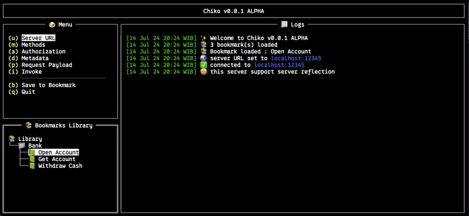

# Chiko - TUI gRPC client

Chiko is a TUI (Terminal User Interface) gRPC client. It is a simple tool to interact with gRPC services using a beautiful terminal interface. This project using [grpcurl](https://github.com/fullstorydev/grpcurl) library to interact with gRPC services, and combine with the beautiful terminal interface using [rivo's tview](https://github.com/rivo/tview) library. I love using `grpcurl` to interact with the gRPC services, but I'm bad at remembering the flags and the syntax. So, I created this tool to help me interact with the gRPC services easily.

## Features
- List all gRPC methods using server reflections
- Generate sample request payload 
- Bookmark support

## To Do
- Add support for metadata (headers)
- Add support to import `.proto` files for service that doesn't support server reflection
- Add support for any kind of authorization types